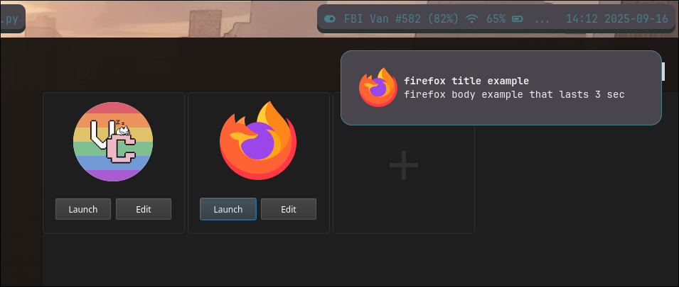
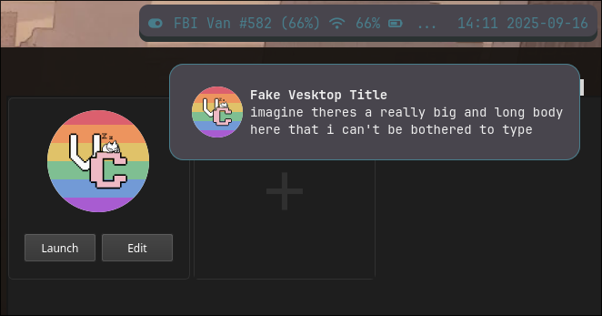

# notification-sender
A GUI wrapper to make sending fake notifications easier 

# How to use
  - navigate to the folder containing main.py
  - run main.py
  - click on the plus to create a new notification template or whatever
  - launch to launch, edit to edit






# other info
this is the command:
```
gdbus call --session \
--dest org.freedesktop.Notifications \
--object-path /org/freedesktop/Notifications \
--method org.freedesktop.Notifications.Notify"
"{self.app_name}" {self.replaces_id} "{icon_arg}" "{self.title}" "{self.body}" {args} {self.duration}
```
not much documentation cause i wrote this entire thing in a day have fun lol
